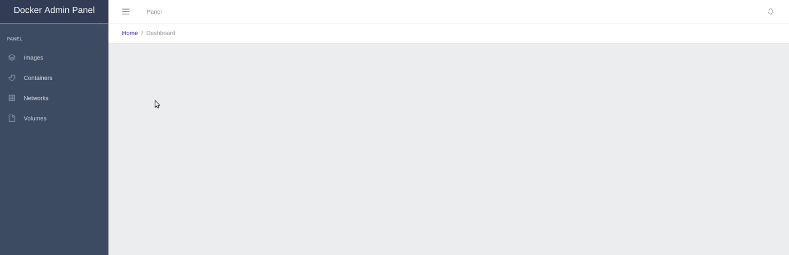

## Docker Admin Panel
Admin Panel for local docker environment

* Go - Backend Api interfacing docker engine (WIP)
* VueJS - Frontend (WIP)

## Backend

`go run *.go`

## Frontend

`yarn install`

### Compiles and hot-reloads for development

`yarn run serve`

### Compiles and minifies for production

`yarn run build`
